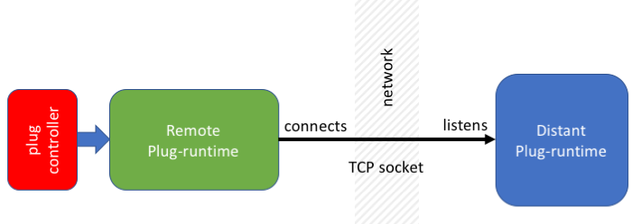

# plug-runtime-remote

`plug-runtime-remote` connects to a distant plug-runtime using a TCP connection.

## Remote protocol

The remote runtime connects to a TCP socket that implements a plug-runtime. 
All requests are initiated from the remote runtime to the distant plug-runtime.
All transfers are using `LITTLE_ENDIAN` encoding.

The remote runtime sends requests to the distant runtime:

- Initial configurations (1),
- Fireable transitions from and (2)
- Fire transition (3).
- Register atomic propositions (4)
- Atomic proposition valuations (5)
    
    
**Initial configurations**

Sends `11` 
and waits for 
`[4:configurations_count][8:configuration_size] ([configuration_size:configuration_id]){configurations_count}`

**Fireable transitions from**

Sends 
`12[configuration_size:source_configuration_id]` 
and waits for 
`[4:transitions_count][8:transition_size]([transition_size:transition_id]){transitions_count}`

The `configuration_size` is known by the distant runtime though not sent.

**Fire transition**

Sends 
`13[configuration_size:source_configuration_id][transition_size:transition_id_to_fire]` 
and waits for 
`[4:configurations_count][8:configuration_size] ([configuration_size:configuration_id]){configurations_count}`

The `configuration_size` and `transition_size` are known by the distant runtime though not sent.

**Register atomic propositions**

Sends `14[atoms_cout:4]([atom_size:4][atom:atom_size]){atoms_count}` 
and no return is excepted

The `atom` is a 'utf-8` encoded string.

**Atomic proposition valuations**

Sends `15[configuration_size:source_configuration_id]` 
and waits for 
`[value_count][value:1]{value_count}`

**Configuration items**

Sends `110[configuration_size:configuration]` and waits for `[4:item_cout]([type][name][icon][item children]){item_count}`

**Fireable transition description**

Sends `111[transition_size:transition]` and waits for `[text]`
